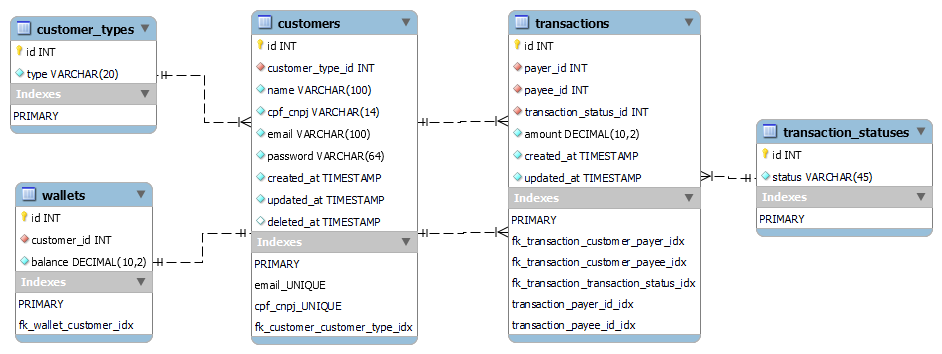
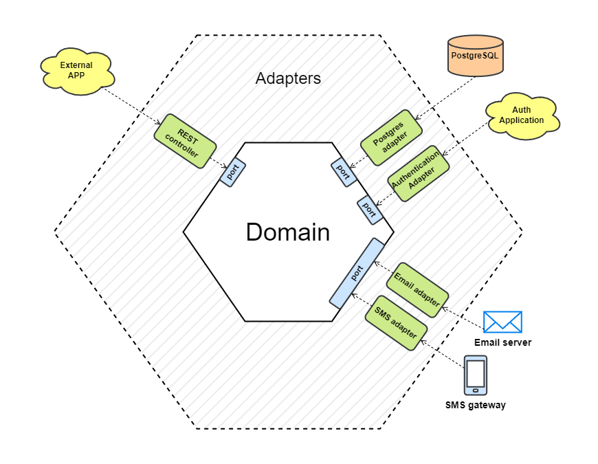
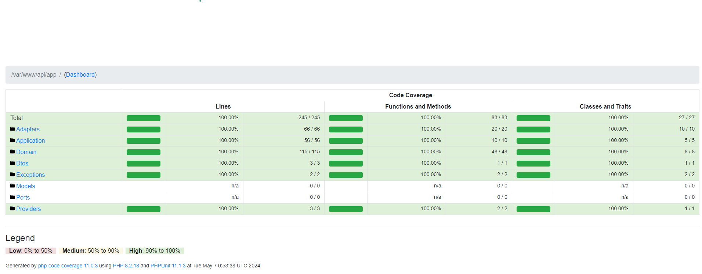

# Jsr Pay

A project designed for monetary transfers with Laravel 11, PostgreSQL, NGinx and Docker, aplying Hexagonal Architecture.

## Requirements
- docker
- docker-compose

## Data Model


## Architecture


## Test Coverage


## Setup

Clone the project

```bash
  git clone https://github.com/jonatamsr/jsr-pay.git
```

Go to the project docker files directory

```bash
  cd jsr-pay/.docker
```

Start the containers

```bash
  docker-compose up -d
```

Install the dependencies

```bash
  docker-compose exec api composer install
```

Copy .env file

```bash
  cp .env.test .env
```

Migrate the database with seeds

```bash
  docker-compose exec api php artisan migrate --seed
```

## Run Tests

```bash
  docker-compose exec api vendor/bin/phpunit
```

## Contributing

@author: Jonatam de Sousa Rocha (jonatamsr@gmail.com)
